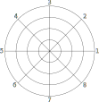

# Super Star Trek

## Instructions

1. When you see `Command ?` printed, enter one of the legal commands ([NAV](#nav), [SRS](#srs), [LRS](#lrs), [PHA](#pha), [TOR](#tor), [SHE](#she), [DAM](#dam), [COM](#com), or [XXX](#xxx)).
2. If you should type in an illegal command, you'll get a short list of the legal commands printed out.
3. Some commands require you to enter data (for example, the `NAV` command comes back with `Course (1-9) ?`.)  If you type in illegal data (like negative numbers), than command will be aborted.

The galaxy is divided into an 8 x 8 quadrant grid, and each quadrant is further divided into an 8 x 8 sector grid.

You will be assigned a starting point somewhere in the galaxy to begin a tour of duty as commander of the starship **Enterprise**; your mission: to seek and destroy the fleet of Klingon warships which are menacing the United Federation of Planets.

You have the following commands available to you as captain of the starship Enterprise:

---

### NAV

*warp engine control*
Course is in a circular numerical vector arrangement as shown integer and real values may be used.  (Thus course 1.5 is halfway between 1 and 2)

Values may approach 9.0, which itself is equivalent to 1.0

One warp factor is the size of one quadrant.  Therefore, to get from quadrant 6,5 to 5,5, you would use course 3, warp factor 1.


---

### SRS

*short range sensor scan*
Shows you a scan of your present quadrant.

Symbology on your sensor screen is as follows:

``` text
symbol description                                      
  <*>  our starship's position                          
  +K+  Klingon battle cruiser                           
  >!<  Federation starbase (refuel/repair/re-arm here!) 
   *   Star                                             
```

A condensed 'status report' will also be presented.

---

### LRS

*long range sensor scan*
Shows conditions in space for one quadrant on each side of the Enterprise (which is in the middle of the scan) The scan is coded in the form [###], where the units digit is the number of stars, the tens digit is the number of starbases, and the hundreds digit is the number of Klingons.

Example - 207 = 2 Klingons, no starbases, and 7 stars.

---

### PHA

*phaser control*
Allows you to destroy the Klingon battle cruisers by zapping them with suitably large units of energy to deplete their shield power.  (Remember, Klingons have phasers too!)

---

### TOR

*photon torpedo control*
Torpedo course is the same as used in warp engine control If you hit the Klingon vessel, he is destroyed and cannot fire back at you.  If you miss, you are subject to his phaser fire.  In either case, you are also subject to the phaser fire of all other Klingons in the quadrant.

The library-computer (`COM` command) has an option to compute torpedo trajectory for you (option 2)

---

### SHE

*shield control*
Defines the number of energy units to be assigned to the shields.  Energy is taken from total ship's energy.  Note than the status display total energy includes shield energy

---

### DAM

*damage control report*
Gives the state of repair of all devices.  Where a negative 'state of repair' shows that the device is temporarily damaged.

---

### COM

*library-computer*
The library-computer contains six options:

| Option   | Command                       | Description                                                                                        |
|----------|-------------------------------|----------------------------------------------------------------------------------------------------|
| Option 0 | cumulative galactic record    | This option shows computer memory of the results of all previous short and long range sensor scans |
| Option 1 | status report                 | This option shows the number of Klingons, stardates, and starbases remaining in the game.          |
| Option 2 | photon torpedo data           | Which gives directions and distance from the Enterprise to all Klingons in your quadrant           |
| Option 3 | starbase nav data             | This option gives direction and distance to any starbase within your quadrant                      |
| Option 4 | direction/distance calculator | This option allows you to enter coordinates for direction/distance calculations                    |
| Option 5 | galactic / region name / map  | This option prints the names of the sixteen major galactic regions referred to in the game.        |

---

### XXX

*exit game*
Print out final status and quit the game
